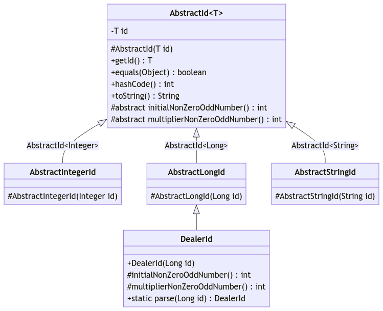
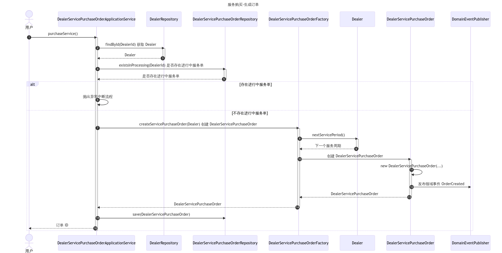
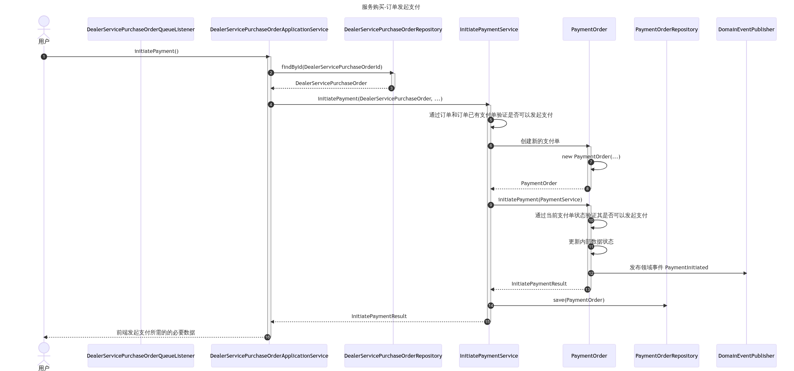
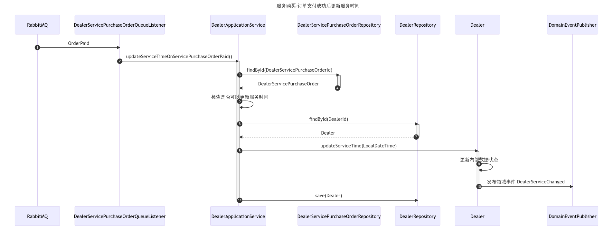
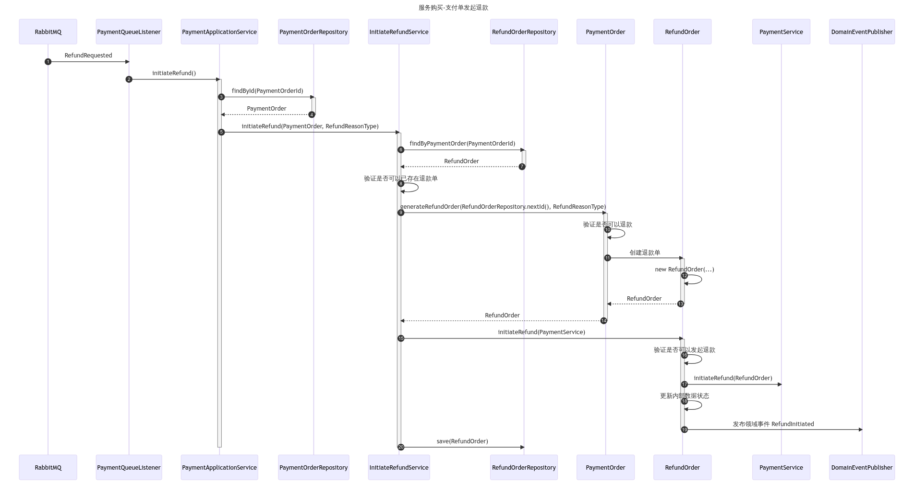
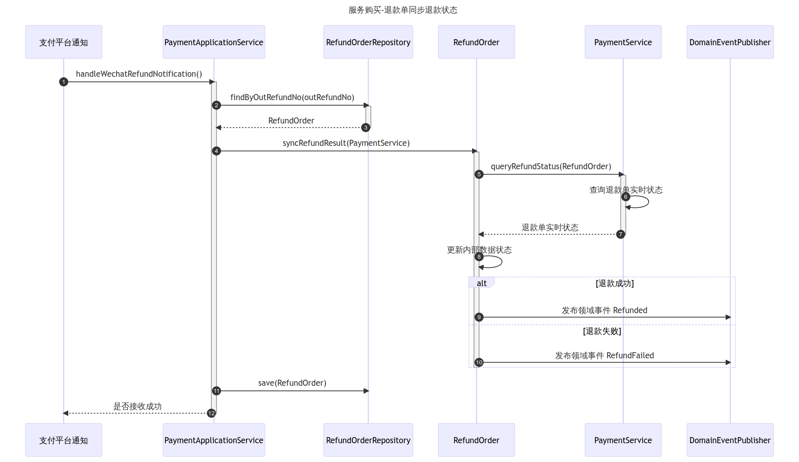

# 领域驱动设计：概念详解与实践指南

## 前言

### 为什么再写一篇关于 DDD 的文章

领域驱动设计（Domain-Driven Design，简称 DDD）是一种软件开发方法论，由 Eric Evans 在 2003 年提出。他在 2003 年出版了一本名为《领域驱动设计：软件核心复杂性应对之道》（Domain-Driven Design: Tackling Complexity in the Heart of Software）的著作，详细介绍了这一方法论。我们频繁地听到 DDD 的名字，也经常讨论它使用它，但它对于大部分人来说却慢慢变得和面向对象编程（Object Oriented Programming，简称 OOP）一样，看似已经融入了我们的编程生活，但真正理解它并用好它却并不容易。

了解过甚至尝试过 DDD 的开发者大概率都是在编程中遇到了问题，期望通过一种方式帮自己解决问题。我们希望 DDD 就是帮我们解决问题的那种方式。涉及 DDD 的书籍和文章不计其数，这正说明了 DDD 的价值，但是大部分开发者未能从中找到落地实践 DDD 的方法，特别是浅显易懂的方法。从本人实践的经历看，经典书籍无论我们何时翻阅，总能在其中找到新的启示和认识，但对于新手来说有些过于抽象不够直白，示例项目也往往和我们的实际需求和经历相去甚远。最终无论我们看了多少书，实践时总是束手无策。甚至于许多开发者简单的认为是自己项目业务太简单了，但就是这些简单的项目把我们搞得焦头烂额。

我觉得根本的原因还是对 DDD 的理解不够透彻，对 DDD 的认知往往仅限于熟知一些 DDD 名词，对于 DDD 能解决什么问题，如何解决这些问题并不知晓。而且大部分人并未有过完整的 DDD 项目实践。对于 DDD 许多人缺的是入门。这也是这篇文章的意义，通过详细的概念讲解和一个简单的项目实践让更多向往 DDD 但不得其解的开发者真正了解并用上 DDD。

### 为什么选择 DDD 作为编程指导思想

代码即文档，这是很多开发者经常挂在嘴边的一句话，虽然经常用来作为不写注释的理由。但这是有前提的，能够良好体现业务需求的代码才是文档。只能由机器执行得到结果的代码还远远称不上文档，只能从这些机器才能理解的代码中了解需求的困境应该很多人都体验过，但是针对这个问题大家既是受害者也是始作俑者。好的代码不仅是需求的一种实现方式，同时也能体现出需求的意图，反之不好的代码总是让人产生一种它为什么这么写的疑惑。

虽然将程序描述为数据结构加算法有些过于笼统，但是大部分业务代码确实可以理解为输入处理、业务逻辑、数据持久化和输出处理。在这种基本划分下开发者基于自上而下的分层架构和 controller、service、dao 等基本概念，再加上天生就会的面向过程的事务脚本的编码方式就能完成需求的开发，简单粗暴有时候甚至好用。但随着业务的发展这样的设计难以为继，对于代码的设计，开发者没有一个不需要太多强制就能默认达到的共识。随着时间推移、人员变更，代码会越来越乱，代码逐渐以追求执行结果为目标，为了实现目标不在乎打了多少补丁，写了多少匪夷所思的逻辑。这也是导致代码不能清晰体现出需求的根本原因。

DDD 通过建立丰富的领域模型，使业务逻辑在代码中的表述更加清晰直观。通过聚合和领域服务等概念为处理复杂业务规则提供了工具。DDD 倡导的设计原则和模式（如实体、值对象、领域事件等）可以帮助我们创建高内聚、低耦合的系统。通过反映业务领域的真实情况，DDD 使得软件更容易适应业务的变化。

### 关于示例项目

理论结合实践才能获得更深的理解和更全面的学习，整篇文章的讨论我们都基于一个汽车经销商网上店铺的项目进行讨论。汽车经销商网上店铺的示例项目主要分为两个子项目项目：产品库项目和网上店铺项目。产品库项目主要用于管理汽车品牌、车系和车型数据，之所以独立出一个项目主要是为了演示 DDD 中如何依赖其他系统提供的功能。网上店铺项目主要包含经销商数据管理、经销商服务购买以及订单的支付、退款等。示例项目的完整源代码可以通过 https://github.com/lowkeyfish/IDDD 获取。

## 概念详解

DDD 是一种方法论，由许多小的概念组成，例如大家耳熟能详的实体、值对象、聚合根、领域服务等。有些概念是抽象的，例如上下文。有些概念是具体的，是代码中会明确体现的，例如实体、值对象、聚合根等。之所以能分出这些概念，就是因为它们相互不同，有本质差异，且在 DDD 中分别承担了不可或缺的职责。因此准确理解并用好这些概念才能发挥出 DDD 的价值。

对于 DDD 基本概念的定义大家都不陌生，因此我们不再过多复述对它们的定义，着重讨论这些概念的本质，以及如何正确使用它们，从而让大家可以对 DDD 有一个整体上的清晰认识，能够准确辨识出 DDD 和其他编程方式的不同。

### 聚合根（Aggregate Root）、实体（Entity）、值对象（Value Object）

编程中可以宽泛的将操作分作两大类：命令和查询。所有命令类的操作都可以最终转换为业务数据的变更。业务数据变更主要的挑战是对业务数据一致性和完整性的保证。DDD 提供了聚合根、实体和值对象用于业务数据的建模，它们可以说是 DDD 最核心的概念，同时也是相对于事务脚本的编程方式最大的不同。在接下来的部分，我们将深入探讨聚合根、实体以及值对象，并提供关于如何有效利用它们的实践建议。

示例项目中的经销商数据管理，按以往的编程方式，我们先在数据库建一个经销商表（dealer），表中的主键作为经销商的 ID。代码中会有一个和数据表字段对应的类，这个数据类对外方法只有 getter 和 setter，调用 setter 方法就可以直接修改数据，数据是否可以修改，修改成什么值都是有事务脚本也就是我们经常说的 service 控制。在 DDD 中，我们会将经销商相关的业务概念建模为实体（`Dealer`），实体的属性用于存储活动相关的业务数据，但并不一定要按照数据库表的结构去设计实体的属性。且在实体中你看不到之前熟悉的公共的 getter 和 setter 方法，因为实体不仅是数据同时也是业务行为的封装。借助实体，调用者的关注点从数据操作转变为了业务行为的执行。

对于不需要唯一标识且具有不变性的对象在 DDD 中被称为值对象，值对象的等价性是基于它们的属性值，而不是某个唯一标识。值对象一般被用作一组相关属性的集合，实体 `Dealer` 中唯一标识 `DealerId` 和地址 `Address` 都属于值对象。

对于业务场景中涉及的实体和值对象，在整个生命周期中作为一个整体维护它们的一致性和完整性是很有挑战的。为此 DDD 提出了聚合的领域概念。聚合有一个聚合根，聚合根是聚合内的一个特定实体，对于经销商聚合来说，我们选用 `Dealer` 实体作为聚合根。由 `Dealer` 作为聚合根管理经销商相关的业务数据，并对外提供业务方法管理内部实体和值对象的一致性和完整性。

以上只是对聚合根、实体和值对象的最基本认识，接下来我们通过以下几点详细讨论如何更好的使用它们。

#### 使用有参构造函数初始化

如果一个类只作为数据容器，除了默认的无参构造函数我们一般不需要再提供有参构造函数。但是聚合根、实体和值对象不止是数据容器，更有对业务规则的封装。聚合根、实体和值对象必须保证其内部数据的一致性和完整性，除了业务方法外它们不会对外提供针对内部字段修改的 setter 方法，因此必须保证它们在初始化后其数据状态就必须是满足业务规则的有效的状态。只有聚合根、实体和值对象使用有参构造函数进行初始化，且在初始化时对参数进行校验才能满足这个要求。聚合根、实体和值对象的实例必须通过有参构造函数进行创建，这一做法与传统的编程方式形成了鲜明的对比。

聚合根和实体需要为不同场景提供不同的有参构造函数，分别用于调用方首次创建聚合根和通过仓库查询后重建聚合根。首次创建聚合根时使用的构造函数仅需提供核心参数即可，仓库重建聚合根需要提供全部的属性值，这些值使用上次聚合根已保存数据。

例如活动聚合根针对不同场景所提供的构造函数：

```java
// 用于仓库重建聚合根
Activity(
	DealerId dealerId,
	ActivityId id,
	String name,
	String summary,
	String image,
	TimeRange registrationTimeRange,
	TimeRange participationTimeRange,
	int participantLimit,
	List<ActivityGift> gifts,
	ActivityStatusType registrationStatus,
    ActivityStatusType participationStatus,
	boolean deleted
);

// 用于首次创建聚合根
Activity(
	DealerId dealerId,
	ActivityId id,
	String name,
	String summary,
	String image,
	TimeRange registrationTimeRange,
	TimeRange participationTimeRange,
	int participantLimit,
	Map<GiftId, Integer> gifts
);
```

两个构造函数的参数类型也有差异，仓库重建聚合根的参数一般与聚合根内部字段保持一致，而首次创建聚合根的构造函数参数一般有以下几点需要注意：

* 参数尽量避免不必要的依赖。例如聚合根需要 `DealerId`，就不能接收 `Dealer`，避免和 `Dealer` 聚合根产生不必要的依赖。即使同时需要经销商聚合根唯一标识和名称，也尽量使用两个参数分别接收而非接收 `Dealer`。只有内部确实需要 `Dealer`（例如需要 `Dealer` 的方法）时才直接接收 `Dealer` 类型参数，因为此时必须和店铺聚合根产生依赖了。
* 参数不能直接提供聚合根内部实体的引用。例如创建聚合根时礼品参数类型为 `Map<GiftId, Integer>` 而非 `List<ActivityGift>`，主要是为了防止外部和聚合根内部使用同一份实体引用，从而外部可以绕过聚合根直接修改实体的数据状态。
* 在构造函数中需要对接收的参数进行数据一致性和完整性校验。如果不满足需要直接抛出异常。而用于仓库重建聚合根的构造函数不需要再对参数进行校验。

#### 聚合根是聚合的唯一入口

通过聚合和聚合根，我们可以将相关的实体和值对象组织在一起，定义严格的边界，封装内部的业务规则，确保业务的一致性和完整性，聚合根是对外界可见的唯一入口。聚合根不能对外提供聚合根内部实体的引用。因为一旦外部可以获取到内部的实体引用就可以绕过聚合根修改实体的状态，这些操作会导致聚合根整体数据的一致性和完整性问题。

#### 聚合根、实体和值对象一定是充血模型

聚合根、实体和值对象都是数据和业务规则的封装。外部对象只能通过调用聚合根和实体的方法完成其状态的变更，值对象也通过提供的方法返回状态变更后的新的值对象实例，因此它们一定是充血模型。如果按照仅有 getter 和 setter 的 Java Bean 来实现，那一定不是 DDD。

#### 把聚合根作为命令模型实现

命令查询职责分离（Command Query Responsibility Segregation，简称 CQRS）模式将应用的读操作和写操作分离开来，使得我们可以独立地扩展和优化它们。

将聚合根作为命令模型实现的确可以大大降低聚合根的复杂性。这是因为在这种模式下，聚合根主要关注的是业务行为，而不是数据查询。这样，聚合根可以专注于处理复杂的业务规则和确保业务数据的一致性，而无需关注各种查询需求。

此外，这种模式还能够避免数据模型的膨胀和分裂。在传统的模型中，为了满足各种查询需求，我们可能需要不断地添加新的字段或者新的关联关系，导致数据模型变得越来越复杂。将聚合根作为命令模型实现，可以避免对聚合根的过度复杂化。

#### 聚合根数据验证的范畴

聚合根 `Dealer` 使用 `BrandId` 标识其售卖的品牌。业务中我们必须保证使用的 `BrandId` 确实有对应的品牌，不能是一个无效的 ID。但 `Dealer` 创建时其构造函数只需要验证传入的 `BrandId` 是否为 null，不需要验证 `BrandId` 是否存在 `Brand`。验证 `BrandId` 是否存在 `Brand` 属于创建 `Dealer` 业务流程中必须保证的业务规则，但不是 `Dealer` 聚合根的职责，应该在应用服务即 `DealerApplicationService` 中执行这个规则验证。

总结来说聚合根（包括用于创建聚合根的工厂）仅需对聚合自身数据进行一致性和完整性验证，自身数据关联对象的验证虽然也属于业务规则但并不属于聚合根的职责。为什么这样做是更好的呢？假设我们想让 `Dealer` 聚合根创建时验证其关联的 `BrandId` 必须有对应的 `Brand`。我们可以通过以下几点分析下带来哪些问题：

* 如果接收 `BrandId`，那获取到 `Brand` 并验证就需要 `Dealer` 具有查询 `Brand` 的能力，就需要让 `Dealer` 增加对 `BrandService` 的依赖。如果你需要同时创建多个 `Dealer` 的实例，就会存在多次重复获取 `Brand`，这是不必要的重复操作。
* 你可能想到可以在应用服务层直接获取到 `Brand` 然后应用服务不校验，传给 `Dealer` 校验。虽然这样可以避免重复获取 `Brand` 的问题，但是 `Dealer` 还是增加了对 `Brand` 的依赖，这实际上是没必要的。
* 即使你不考虑额外依赖 `Brand` 的问题。创建 `Dealer` 时传的是 `Brand`，构造函数中就必须验证 `Brand` 是否为 null，否则就可能在获取 `BrandId` 时遇到空引用问题。但是如果应用服务层获取到 `Brand` 后也需要做其他的规则判断，例如，创建经销商时需要检查使用的城市和品牌是否支持创建，这样就出现了多处对同一业务规则做校验的重复性操作。

#### 聚合根的依赖

聚合根一般应该视为是一个用时创建用完回收的短生命周期对象。聚合根不能像 Service 一样初始化时就依赖其他领域服务或资源库。

如果聚合根自身无法完成某个操作，但又需要保证其内部数据的一致性和完整性，那么聚合根就可以依赖其他的领域服务来完成这个操作。例如发起支付场景，支付单聚合根 `PaymentOrder` 使用方法 `initiatePayment(PaymentService)` 发起支付，用于向支付平台发起支付的领域服务 `PaymentService` 就作为参数被 `PaymentOrder.initiatePayment` 方法使用。

聚合根不对外提供数据查询，也不关注自身的获取和持久化，因此聚合根不需要也不能依赖资源库。

#### 使用值对象作为唯一标识

使用值对象作为唯一标识相对于原始数据类型有以下优势：

* 更好的封装性：值对象可以封装一些与标识相关的行为和逻辑，而原始数据类型不能。
* 更高的类型安全性：使用值对象可以提供更高的类型安全性。假如一个方法同时接收活动 ID 和经销商 ID 作为参数，使用 `(ActivityId activityId, DealerId dealerId)` 比 `(String activityId, String dealerId)` 有更高的类型安全性。
* 更丰富的业务语义：值对象可以具有更丰富的业务语义。例如，`ActivityId` 比一段字符串更能表明其作为活动唯一标识的业务含义。


#### 聚合根的粒度应该尽量小

在可能的情况下尽量将聚合根设计的足够小。例如，经销商服务购买场景我们会设计三个聚合根：订单聚合根 `DealerServicePurchaseOrder`、支付单聚合根  `PaymentOrder`、退款单聚合根 `RefundOrder`。虽然这三个聚合根在业务上存在关联，但是我们不会将支付单和退款单作为订单聚合根的内部数据，因为这样做存在以下缺点：

1. 因为支付单和退款单属于订单内部数据，因此操作支付单和退款单都需要对订单加锁，这对并发控制和性能优化非常不利。
2. 每次重建订单聚合根都需要获取和处理大量的数据，可能会对性能产生影响。
3. 聚合的所有操作必须通过订单聚合根作为入口，可能没有支付单、退款单独自作为聚合根时直观。

总的来说，设计小的聚合可以使得聚合更加内聚，关注的业务范围更小，更符合单一职责原则。当不同的聚合有业务上的关联时，我们可以通过领域事件来协调它们的行为，实现聚合间的低耦合协作。


#### 值对象应该是不可变的

值对象也是业务数据和行为的封装，但值对象方法并不直接修改当前值对象实例的数据状态，如果值对象方法是用来修改当前值对象的状态，那么由于值对象是不可变的，这个方法通常会返回一个新的值对象（类似于 `LocalDate.now().plusDays(1)` 直接返回了一个新的实例）。让值对象保持不变性使其创建后状态就固定了，不会出现难以预料的状态变化，使得值对象可以放心的被使用而不担心被其他对象修改，使得代码更易于理解和使用。

#### 迪米特法则和 “Tell，Don't Ask” 原则

在 DDD 中，我们通过聚合根、实体和值对象封装业务逻辑。这些对象不仅包含数据，还包含操作数据的行为。我们应避免通过领域对象查询其数据状态，然后在外部进行业务逻辑判断后再修改它的数据。应该直接告诉领域对象要做什么，让它自己完成操作。

例如，支付单发起支付的场景，以往的编程方式调用方会主动询问 `PaymentOrder` 的当前状态，如果当前状态可以发起支付，调用方会调用 `PaymentService` 发起支付，然后再更新 `PaymentOrder` 状态为已发起支付。在 DDD 中，调用方只需要调用 `PaymentOrder.initiatePayment(PaymentService)` 即可，`PaymentOrder.initiatePayment` 方法内部自己保证只有在支付单状态满足时才发起支付，并在支付发起后更新其内部数据状态，从而可以更好保证聚合根的数据状态的正确性。

遵守这两个原则可以使我们的代码减少耦合、提高封装性和可读性。按照 DDD 思想正确实现的领域对象都能够很好的遵守这两个原则。

#### 聚合根对外暴露的数据

聚合根可以对外暴露一些数据，只是暴露数据前需要保证暴露的数据不会被外部修改而破坏聚合根状态的正确性。可以对外暴露的数据有：

* 唯一标识：聚合根的唯一标识通常需要对外暴露，它是外部用来引用聚合的唯一方式。
* 值对象：值对象是不可变的，可以安全的对外暴露。如果需要对外暴露内部实体的数据，也需要将其转为值对象后再对外暴露。
* 快照：聚合根不对外提供 getter 方法，为了满足聚合根的持久化，可以让聚合根返回其数据状态的快照，快照对象属于值对象可以被安全的使用。对于一些 ORM 框架，可以通过反射获取到聚合根的私有属性，这种情况下就没有必要再提供快照数据了。

#### 单个事务中只允许对一个聚合根进行修改

单个事务中只对一个聚合根进行修改是 DDD 中一个非常重要的原则。遵守这个原则有以下好处：

* 并发处理加锁更容易处理：因为一个事务中只修改一个聚合根，操作的聚合根是显而易见的，可以方便的对正确的资源进行加锁。如果一个事务中涉及多个聚合根，有些聚合根可能操作所处的流程可能比较深，甚至是中间步骤的数据，不容易在流程开始位置加锁。而且多个资源加锁，更容易造成死锁。

* 有助于我们避免处理修改多个聚合根以保证数据一致性所带来的复杂性：当我们需要在单个事务中修改多个聚合根时，通常需要使用更复杂的技术，如分布式事务，以确保数据一致性。这不仅增加了系统的复杂性，还可能带来性能问题。
* 有助于实现系统解耦：通过领域事件的发布和订阅，不同聚合根之间可以实现解耦，能够更容易进行微服务或模块的拆分和独立开发。

* 易于理解和维护：当一个事务中只涉及一个聚合根时，相关的业务逻辑会更清晰，代码会更易于理解和维护。
* 更容易实现幂等操作：例如，订单状态设置为已支付，如果当前状态已经是已支付，订单聚合根方法就可以不做任何操作，也不发布领域事件。因为数据没有变动，所以订单持久化也不会产生副作用。如果一个事务中不仅涉及订单的操作，订单方法就必须在无法设置为已支付时抛出异常，因为这样才能将整个流程中断，避免其他操作因为订单设置为已支付而执行。


### 工厂（Factory）

当创建一个领域对象或聚合根时，如果创建工作很复杂，或者暴露了过多的内部结构，可以使用工厂进行封装。

工厂存在的形式一般有三种：单独的工厂类、聚合根用于自身元素添加而提供的工厂方法和领域对象为其他对象创建而提供的工厂方法。

#### 单独的工厂类

例如，经销商服务购买场景中使用 `DealerServicePurchaseOrderFactory` 创建聚合根 `DealerServicePurchaseOrder`。虽然看起来创建逻辑不复杂，但是使用工厂类能够使应用服务不用关注创建的细节，是的代码流程开起来更清晰流畅。

不过，一般还是建议优先使用聚合根的构造函数，只有构造函数无法满足时再尝试使用独立的工厂类。

#### 聚合根用于自身元素添加而提供的工厂方法

在聚合根上添加工厂方法用于为自身添加元素可以把聚合根的内部实现细节隐藏起来，同时聚合根也可以确保添加元素时其自身数据的完整性。例如，活动聚合根提供用于添加礼品的工厂方法用于为自己添加更多的礼品。

#### 领域对象为其他对象创建而提供的工厂方法

一个对象与另一个对象密切相关，但其并不拥有所生成的对象。当一个对象的创建主要使用另一个对象的数据或者规则时，可以在后者的对象上创建一个工厂方法，这样就不必将后者的信息暴露出来。例如，支付单聚合根 `PaymentOrder` 上提供了工厂方法 `generateRefundOrder` 用于创建退款单聚合根 `RefundOrder`。

使用这种类型的工厂方法时我们需要避免一些误区。例如，大部分聚合根和 `Dealer` 有关系，即大部分聚合根的创建都需要 `DealerId`，那么应该在 `Dealer` 中为这些和它有关的聚合根创建工厂方法吗？

聚合根创建需要 `DealerId`，你需要对 `DealerId` 校验其是否存在 `Dealer`，甚至还要判断 `Dealer` 的一些状态或权限。基于这些考虑，你可能会觉得在 `Dealer` 中为其它聚合根创建工厂方法好像挺好的，甚至于使用起来还挺面向对象的。那我们应该这么做吗，结论当然是没有必要这么做，甚至于要避免这样做。

原因当然是这样做是弊大于利的，我们可以通过以下几点来分析它的弊端：

* `Dealer` 后续会频繁的为其它聚合根添加工厂方法，这也将导致 `Dealer` 类越来越臃肿。
* 一个聚合根可能会和多个聚合根有关系，那用于创建当前聚合根的工厂方法应该放到哪个聚合根上又会对我们造成困扰。例如，`DealerModel` 表示经销商在售车系，它需要 `DealerId` 和 `ModelId`，为什么在 `Dealer` 上为其提供工厂方法而不是由 `Model` 提供。毕竟业务流程中也需要验证 `ModelId` 是否存在车系甚至车系状态。
* 很多时候不属于一个业务场景的聚合根可能不在一个服务中部署，例如，`Dealer` 和 `Activity` 可能会部署到分开的服务中，`Activity` 所处的项目中就不存在 `Dealer` 聚合根。这种情况下你又面临了无 `Dealer` 聚合根可用的问题。

总结来说，如果两个聚合根处于同一个业务场景中，并且它们之间有强业务规则关联，那么在一个聚合根中为另一个聚合根提供工厂方法是很有意义的，例如，支付单和退款单。这样可以保证业务规则的实施，并且使得领域模型更加符合业务逻辑。反之，就没有必要在一个聚合根中为另一个聚合根提供工厂方法，这样可以避免不必要的耦合，也使得领域模型更加清晰，也更容易维护和扩展。


### 资源库（Repository）

资源库用于存储、检索和删除聚合根。每个聚合根都有其对应的资源库，且只有聚合根才能有资源库，每个资源库也仅用于一个聚合根。资源库的命名一般以聚合根名称加后缀 `Repository` 组成。例如聚合根 `Dealer` 其资源库为 `DealerRepository`。

聚合根是聚合对外的唯一入口，因此资源库操作的对象必须是聚合根，即资源库保存的对象是聚合根，查询出的对象还是聚合根，这样可以确保聚合的一致性。

资源库一般会针对其聚合根提供必须的几个方法，例如 `DealerReponsitory` 提供了 `findById(DealerId)`、`save(Dealer)` 和 `remove(Dealer)`。

因为资源库操作的对象是聚合根，所以如果用资源库执行复杂的查询，无论是复杂的查询条件，还是查询非聚合根粒度的数据，使用资源库都不是一种很舒服的方式。使用 CQRS 我们应该尽量把查询相关的需求提到查询服务中。这样做的结果就是资源库提供的方法就变得更单一了，资源库提供的聚合根相关的方法也主要满足写操作下的需求即可。

使用资源库通过标识查找聚合根，通过调用聚合根方法完成其状态变更，然后使用资源库保存聚合根。资源库和聚合根的交互使用起来就是这么简单。我们不应该要求资源库承担太多的职责。资源库仅用于聚合根的管理，复杂的查询、涉及多张表的连表查询或者以性能为首要目标而只想返回部分数据的场景都不宜放到资源库中。

当然资源库也不是不能提供其他方法，但是如果将资源库作为你唯一的持久化数据管理手段只会让你感到使用时的局限性。例如查询的对象必须是聚合根，如果不是用于写操作，构建聚合根是不必要的性能浪费。如果你为了性能不想返回聚合根，你只能返回值对象而非聚合根内部的实体等可能破坏聚合根数据正确性的数据类型。明显是用于读操作场景的方法还是放到查询服务中更合适。


### 领域服务（Domain Service）

聚合根、实体和值对象都是数据和业务规则的封装，它们是领域层的核心，是外部与领域层交互的主要对象。即使它们封装了大部分的业务规则和业务逻辑，但还有一些不适合它们独自处理的业务场景，领域服务就是作为补充这些缺失部分的角色存在的。


#### 使用领域服务的场景

* 涉及多个聚合根的操作。

	当业务逻辑涉及多个聚合根时，这些业务逻辑无论放到哪个聚合根上都不合适，就可以提出单独的领域服务协调这些聚合根的状态变更，这是领域服务的典型应用场景。
  
* 无法将逻辑自然的分配给聚合根、实体或值对象。

	例如经销商名称需要满足唯一性检查，这个操作无法放到经销商聚合根中，只能作为领域服务实现。
  
* 逻辑需要重用。

	如果一个逻辑需要在多个聚合根之间共享和重用，可以将其定义为领域服务。
  
* 逻辑依赖外部资源或服务。

	如果业务逻辑需要与外部系统或资源进行交互，可以将其封装为领域服务。领域服务可以处理外部资源的访问和适配，将领域对象与外部依赖解耦。
  
#### 使用领域服务中的一些注意事项

* 聚合根、实体和值对象是领域的核心，领域服务应该作为它们的辅助，避免使用领域服务替代它们的所有行为，以免将聚合根、实体和值对象变成贫血模型。
* 领域服务属于领域层，其方法定义入参和返回值应该都是领域对象，不能是展示层或基础设施层的对象。
* 领域服务是无状态的。
* 领域服务应该满足单一职责，且领域服务命名尽量满足其业务操作场景，避免将不相关的领域操作放到一个领域服务中。


### 领域事件（Domain Event）

领域事件是 DDD 中除了聚合根、实体和值对象外最重要的概念，同时也是 DDD 中最不可或缺的组成部分。缺少了领域事件，其他概念的使用指导将会从最佳实践变成桎梏。

领域事件代表了在业务领域中发生的一些重要的、有意义的事件，比如 `DealerCreated`、`ActivityCreated` 等。这些事件通常由领域对象（如聚合根或实体）在状态变化时触发，并被其他的领域对象或服务订阅和处理。

#### 使用领域事件改变编码方式

领域事件的最大的意义莫过于改变了编码方式。领域事件对应业务中一些关键数据变更节点，这些关键节点也是项目迭代过程中最容易延伸出新的业务规则的地方。在传统的过程式编程中，我们的代码往往是命令式的，需要明确指定每一步的操作。而使用领域事件，我们的代码则变成了响应式的：我们只需要让聚合发布事件，然后其他部分的代码可以订阅这些事件并作出响应。

例如，活动报名后需要发送报名短信给用户，传统编程方式，需要在活动报名的代码中直接调用发短信代码。这种方式有一些缺点：发短信和报名逻辑耦合在了一起，使得代码难以阅读和维护。发送短信可能会失败，这会影响到活动报名的操作。而且以后一旦需要针对活动报名增加新的需求，活动报名相关代码将被频繁修改。

使用领域事件，可以改变这种方式：当活动报名时，只需要发布一个 `ActivityRegistrationCreated` 事件。然后我们可以有一个单独的服务订阅这个事件，并在收到事件时发送报名短信。这样，活动报名和发送短信就解耦了，使得代码更加清晰，也更容易维护。即使发短信失败，也不会影响到活动报名的操作。而且活动报名的逻辑也不会因为后续报名场景增加新的需求而频繁变动。

#### 由谁发布领域事件

领域事件应由聚合根、实体或领域服务发布。聚合根、实体和领域服务是业务规则的执行者，它们知道何时何地应该发布领域事件。当聚合根或实体的状态发生变化时，或者领域服务完成特定的业务操作时，它们会发布对应的领域事件。不能在其他位置发布领域事件，例如，不能在应用服务中发布领域事件。

聚合根创建成功的场景，一般可以在聚合根的构造函数中发布领域事件。聚合根状态变更的场景一般由对应的聚合根方法发布领域事件。例如，聚合根 `Dealer` 用于创建的构造函数会发布领域事件 `DealerCreated`，数据更新方法会发布领域事件 `DealerInfoUpdated`。

一些场景领域事件如果不能通过聚合根或实体发布，可以在执行领域操作的领域服务中发布领域事件。


#### 领域事件应该包含的信息

领域事件应该包含以下信息：

* 事件名称

	事件名称应该清晰地表达出业务发生了什么事情。例如 `DealerCreated`、`PaymentInitiated`。
  
* 事件源的标识

	事件源就是触发事件的聚合根或实体，它的标识符应该包含在领域事件中，以便知道是哪个对象发布了事件。例如，支付单聚合根 `PaymentOrder` 发布了领域事件 `PaymentInitiated` ，事件应该包含支付单标识 `PaymentOrderId`。
  
* 事件发生的时间

	事件发生的时间是领域事件的重要组成部分，它可以帮助我们知道何时发生了这个事件。
  
* 事件相关的业务数据

	除了事件源的标识和事件发生的时间，领域事件还应该包含与事件相关的业务数据。这些数据应该足够让事件的订阅者理解和处理这个事件。
  
    如果希望在消费事件时实时获取事件源信息，也可以不在事件中包含业务数据。但这会带来一些使用上的不便，事件消费逻辑需要知道获取事件源信息，如果消费逻辑和事件源不在一个系统的话，获取事件源信息的复杂性会进一步提升，而事件包含业务数据的话这些都可以避免。
  
    如果你使用事件溯源（Event Sourcing）架构模式的话，领域事件就必须包含事件相关的业务数据了。
  

#### 领域事件的持久化

领域事件的持久化作为整个项目的基础，作为调用方的应用服务需要对领域事件的发布和存储无感知，领域事件的发布者只需发布领域事件也无需关注领域事件的持久化。为了保证聚合根数据状态变更和领域事件发布的一致性，可以将领域事件和聚合根在一个事务中进行持久化。

在示例项目中我们会使用 `DomainEventPublisher` 用于事件的发布。且提供 `DomainEventProcessor` 基于 AOP 在所有应用层方法执行前为 `DomainEventPublisher` 的当前实例设置领域事件订阅者，领域事件订阅者用于将领域事件存储到数据库。通过 `DomainEventPublisher` 发布领域事件时会查找设置的领域事件订阅者将领域事件实时存储到数据库，以此将业务数据和领域事件在一个事务中进行持久化，保证它们同时成功或失败。

#### 领域事件的通知和订阅

领域事件通知面临的首要问题是确保业务数据变更和领域事件通知的一致性。具体而言，我们必须避免出现数据成功变更但领域事件未成功通知，或者领域事件已经通知但数据未成功变更的情况。因此我们采取将业务数据变更和领域事件持久化在一个事务中处理，而事件通知在独立的流程中处理。

将事件通知在独立的流程中处理，可以保证已发布的领域事件一定能够成功对外通知，只需要领域事件订阅方处理好事件消重即可。

在示例项目中，通过定时任务将指定的领域事件使用消息队列的方式进行通知。在数据库表中记录每个领域事件类型已通知过的最大记录 ID，相较于为每个领域事件数据记录单独标识是否通知的状态，为每个事件类型记录最大 ID 将大大减少数据库操作的频率。而且可以方便的通过重置已通知事件类型的最大记录 ID 来实现领域事件的重复通知。

### 应用服务（Application Service）

应用服务首先还是服务，也就是我们通常认知中的 Service。我们以往事务脚本编程方式写的 Service 是和应用服务最接近的，DDD 中应用服务也是针对具体业务场景的用例流程，你的每一个业务场景都会对应到一个应用服务的方法。但是应用服务和旧的服务编写方式的不同是，应用服务仅仅是非常薄的一层，它主要是通过协调调用领域层对象来实现具体的业务流程，应用服务自身不应该包含任何领域逻辑相关的代码。

#### 应用服务的特征

应用服务使用上有区别于其他服务的明显特征：

* 应用服务位于应用层

* 应用服务命名以 `ApplicationService` 结尾
	
    使用 `ApplicationService` 作为应用服务的统一后缀可以在命名上将应用服务和其他服务区分开。例如，`DealerApplicationService`、`ActivityApplicationService`。
    
* 应用服务的方法都是写操作

	在 CQRS 模式下应用服务只用负责处理所有的写操作，这些操作通常对应于业务场景中的具体行为或命令，因此服务方法名通常反映了它们要执行的具体业务操作，例如，`DealerApplicationService` 针对创建、更新名称以及启用和禁用提供了方法 `create()`、`changeName()`、`enable()` 和 `disable()`。

* 使用特定的 `Command` 类作为应用服务方法的入参

	在 CQRS 模式中，我们通常会创建特定的 `Command` 类来封装特定业务场景需要的所有参数。例如，`DealerApplicationService.create(DealerCreateCommand command)`。使用专用的 `Command` 类作为参数有以下几点好处：
  
    * `Command` 的创建满足原子性，可以在其构造函数中对参数做校验，应用服务方法使用 `Command` 时只需要校验参数是否为 `null` 即可，使应用服务方法更专注于业务流程的处理。
    * `Command` 类可以像值对象一样实现为不可变的，不用担心后续流程无意中对其修改。
    * 以往编程方式下可能会存在一个数据库表对应的数据模型从展示层、服务层到数据持久层一通到底的现象，甚至一个数据模型不同场景分别使用部分字段的情况，随着业务发展无法再清晰的知道场景所需参数，而且后续流程也无法清晰的知道一些字段是调用方传递的还是某一个流程设置的。使用 `Comamnd` 可以避免这种问题，每个方法都对应自己的 `Command`，仅包含自身业务场景所需的参数，不同场景相互没有影响，`Command` 也仅用于传参不会对后续流程产生副作用。
  
* 应用服务方法不需要返回值

    如果调用方需要获取执行结果，使用端口适配器模式，应用服务方法可以接收 `CommandResult` 接口作为参数，然后通过调用方提供的实现向外传递操作结果。

    
#### 应用服务的职责

应用服务和领域服务的职责不同，领域服务主要是领域规则的处理，应用服务主要是作为完成特定业务场景操作的入口。应用服务的职责包含：

* 事务控制
	
    作为业务场景操作的入口，应用服务通常也是事务的边界，因此事务由应用服务控制。
    
* 安全性和权限检查

	安全性和权限检查都不是领域相关的内容，它们都由应用服务负责。
  
* 协调和驱动领域对象进行工作

	应用服务协调多个领域对象，以实现一个完整的业务流程。应用服务不应该包含业务规则或复杂的业务逻辑，自身应该作为一个协调者，例如，`DealerApplicationService` 通过领域服务 `DealerNameUniquenessCheckService` 验证创建经销商使用的名称在系统中唯一，使用 `Dealer` 聚合根创建新的实例，并通过 `DealerRepository` 对 `Dealer` 聚合根完成持久化操作。


### CQRS（Command Query Responsibility Segregation，命令查询职责分离）

CQRS 主张将应用的读操作和写操作拆分开，分别处理查询（Query）和命令（Command）。由于读操作和写操作被分离，可以根据需要独立优化读操作和写操作，提高系统性能。

#### 命令模型

我们上面提到的应用服务和聚合根都是用于写操作的，它们都不应该提供数据查询方法。也就是说涉及数据查询的场景就和应用服务、聚合根无缘了。聚合根是业务数据和行为的封装，为了保证数据一致性和完整性，聚合根基本上只对外暴露方法，这就限制了数据查询场景的使用。而且由于聚合根在设计上强调的是保证业务规则的执行和数据的一致性，强制将聚合根用于数据查询不仅性能比较差，也会破坏聚合根的封装性。资源库也主要用于写操作场景，尽量不要在资源库中添加和聚合根操作无关的查询方法。

#### 查询模型

使用查询服务对外提供数据查询。使用查询服务时我们也可以对一些类的命名做一些规范，例如，查询服务都以 `QueryService` 作为名称后缀。

查询服务获取数据不一定要使用资源库。对于复杂的数据查询需求，例如需要从多个聚合根获取数据，或者需要进行复杂的数据处理等，通过资源库进行查询可能会面临性能问题，也可能会导致资源库的代码复杂度增加。查询服务获取数据可以使用任意便捷的技术实现，例如，使用 MyBatis 时你可以直接在查询服务中使用 Mapper，直接查询出当前场景需要的数据。

不要使用领域对象（如聚合根和实体）而应该使用专门的 `ViewModel` 作为对外返回数据的类型。数据展示的需求是多变的，直接使用领域对象作为返回类型，可能会限制数据展示的灵活性。

即使通过更底层的数据查询技术查询数据，实时获取和拼装数据在许多场景下也无法满足性能要求。可以通过一些策略来提高查询性能：

* 数据缓存

	例如，使用 Redis 作为数据缓存，可以大大降低访问数据库的频率，从而提升查询性能。通过使用领域事件，我们有机会通过订阅领域事件达到数据缓存的近实时更新。
  
  要想高效的使用和管理数据缓存，不能简单的基于方法来做缓存（如使用 Spring 的 @Cacheable）。应该基于业务数据模型来设计缓存，从而更好的控制缓存数据的粒度，也更容易基于领域事件管理缓存的更新。当然这样做需要手动编写更多的缓存操作代码，但从长远来看，这样做能够提供更高的缓存利用率，更好的缓存管理以及更强的可扩展性。
  
* 预先计算和存储

	当缓存不存在时，实时查询数据可能会对性能造成较大波动，特别是当数据需要通过外部接口获取时，接口的性能可能无法满足需求。为了解决这个问题，可以采取预先计算、预先获取，提前针对数据查询场景准备好对应的数据，提前处理好的数据可以在数据库中存储，数据库表可以和数据缓存结构保持一致。为了保证数据的实时性，我们可以通过领域事件订阅的方式，及时更新数据库和缓存中的数据。当缓存不存在时，可以直接从数据库中获取数据并填充到缓存中。这种预先处理的策略，可以将复杂的数据查询简化为简单的读缓存和读数据库操作，大大提高了系统的性能。同时，使用数据库作为备份，也提高了系统的可靠性。


### 架构

#### 洋葱架构


洋葱架构将系统分解成一系列同心圆，这些同心圆代表了系统的不同部分和层级。洋葱架构由外向内分别是：基础设施、用户接口、测试，应用服务，领域服务，领域对象。

在洋葱架构中，每一层只能依赖它内部的层，内部的层可以独立外部的层发展。例如，领域层可以被应用层和基础设施层引用，而领域层不能引用应用层和基础设施层。通过依赖倒置将接口定义在领域层，在基础设施层实现领域层定义的接口。

#### 六边形架构


六边形架构也成为端口与适配器。六边形架构将应用分为内部和外部两部分。内部通常包含应用层和领域层。内部和外部是完全隔离的，不直接和任何外部元素进行交互。内部通过定义一系列端口（即接口）与外部进行交互。外部包含了所有与内部交互的元素，例如，用户界面、数据库、外部服务、测试代码等。外部通过适配器实现内部定义的接口，从而和内部进行交互。

六边形架构端口分为两类：

* 输入端口

	输入端口是有应用的内部提供给外部的接口。定义了应用可以提供的服务或操作。外部通过调用这些输入端口（接口）来驱动应用的业务逻辑。简单来说，输入端口是应用内部定义的用来接收外部请求的接口。
  
  一般情况下我们可以不使用输入端口，例如，应用服务可以直接被外部调用，不用单独定义接口让应用服务实现，然后外部调用应用服务实现的接口。当然使用接口可以带来更好的解耦，更容易的测试以及更大的灵活性和扩展性。

* 输出端口

	输出端口是应用内部需要的接口，但是由外部来实现，在 DDD 中这些实现都位于基础设施层。它们定义了应用内部需要的资源或服务，如访问数据库、外部接口等。应用的内部（如应用服务或领域服务）通过调用这些输出端口来使用这些资源或服务。简单来说，输出端口是应用的内部定义的用来使用外部提供的服务或资源的接口。例如，资源库的接口定义在领域层，实现位于基础设施层。对外部接口的使用会在领域层定义领域服务接口，然后在基础设施层实现这个领域服务接口。
  
#### 选用哪种架构

在 DDD 开发中往往会结合使用六边形架构和洋葱架构。这两种架构都支持 DDD 的核心原则和概念。

六边形架构强调的是从依赖管理的角度对系统进行抽象和解耦，通过定义清晰的接口（端口）和实现（适配器），使得应用的业务逻辑（应用和领域层）与技术细节（基础设施层）解耦，这极大地提高了代码的可测试性和可维护性。

而洋葱架构则从层次结构的角度进行系统设计，核心领域位于中心，周围是领域服务，再外层是应用服务，最外层为基础设施。这种设计的一个优点是，内层的领域逻辑不会被外层的具体实现（如 UI, 数据库等）污染。

结合这两种架构，我们可以在保证代码清晰、高效的同时，也充分利用了 DDD 的优点，例如：聚焦领域逻辑，业务与技术的解耦，以及提高代码的可维护性和可扩展性等。

## 实践指南

### 项目结构


### 领域事件的持久化、通知与订阅

确保业务数据和相应的领域事件发布的一致性是我们在使用领域事件时需要首先解决的问题。我们必须确保他们或者全部成功，或者全部失败。通过将业务数据和领域事件的发布封装在同一事务中进行持久化，我们能够有效地实现这一目标。

尽管领域事件和业务数据在同一事务中进行持久化，我们仍应确保领域事件的持久化操作在实现层面与业务流程保持隔离。利用 AOP，我们可以轻松实现领域事件的同步持久化，同时不对业务流程产生任何侵入，从而在保证系统功能的同时，也维持了代码的整洁和业务逻辑的清晰。

在 DDD 中，所有的写操作都是通过位于应用层的应用服务进行的。因此，我们可以将 ApplicationService 的方法作为 AOP 的切入点，并通过简单的发布-订阅机制，实现领域事件的发布和持久化。

下图详细地描绘了这一过程：


将领域事件和业务数据同步持久化仅仅解决了首要问题。我们只有在领域事件完成对外通知后，领域事件的发布流程才能算是最终完成。为了实现这一目标，我们可以利用定时任务来进行领域事件的对外通知。

我们可以为每一种领域事件设定独立的定时任务，并将执行间隔设定为每秒一次，以确保持久化的领域事件能够及时完成对外通知。在完成对外通知后，我们并不直接管理每条领域事件记录的通知状态，而是仅记录每种领域事件已通知的最大事件记录ID。这样的设计既减少了数据库更新操作，又可以通过重置领域事件通知的跟踪ID来实现领域事件的重复通知。

下图详细地展示了整个流程：


通过订阅领域事件通知，我们可以对特定的业务操作进行响应，进而实现系统间的解耦，这有助于提升系统的灵活性和可维护性。在这种机制下，各系统模块可以独立地响应和处理自己关心的领域事件，而无需了解事件的全局处理过程，从而实现了业务逻辑的高内聚和低耦合。

具体的订阅流程如下图所示：


### 通过示例演示如何使用 DDD

我们接下来用于演示的示例主要涉及以下几部分：

* 聚合根 ID 的设计。
* 经销商数据管理。
* 经销商服务购买：订单创建、支付和退款。
* 经销商服务临近到期提醒。

#### 聚合根 ID 的设计

在概念详解部分我们已经讨论过使用值对象作为唯一标识的好处。涉及到具体的设计，提供抽象泛型类 `AbstractId<T>`，并针对不同的数据类型，分别提供子类 `AbstractIntegerId` `AbstractLongId` `AbstractStringId`。具体的聚合根标识只需直接继承对应的子类即可，例如，`Dealer` 聚合根标识 `DealerId` 就继承自 `AbstractLongId`。



#### 经销商数据管理

经销商数据管理写操作场景主要包含：经销商创建、修改名称、修改联系电话、修改地址以及漏出状态管理和服务时间更新。通过经销商数据管理相关的代码设计，我们可以从整体上完整的了解如何使用 DDD 来实现我们的需求，以及如何基于 CQRS 实现写操作和读操作的分离。

完整的类设计如下图：


从上面的类图可以看出，应用服务 `DealerApplicationService` 是业务场景的操作入口，其中所有的方法都没有返回值，且使用 `Command` 作为参数，如果操作需要对外提供操作结果，基于六边形架构，可以使用 `CommandResult` 接口来向外输出操作结果。

所有写操作的核心都是对聚合根的操作，这里也就是对聚合根 `Dealer` 的操作。由资源库 `DealerRepository` 提供对聚合根 `Dealer` 的查询和持久化。对于经销商名称不能重复的业务规则通过领域服务 `DealerNameUniquenessCheckService` 提供支持。聚合根需要自己保证其内部数据的正确性，因此 `Dealer` 聚合根 `changeName` 方法通过参数依赖领域服务 `DealerNameUniquenessCheckService	`，用于保证其被更新的名称是符合业务规则的。领域事件的可以通过聚合根或领域服务发布，这里由聚合根 `Dealer` 在不同场景发布不同的领域事件。为了探讨更本质的实现方式，虽然也使用了 MyBatis，但我们仍采用了更手动的方式完成聚合根的查询和保存，因此示例代码中我们提供了值对象 `DealerSnapshot` 用于在持久化时可以获取到全部的 `Dealer` 聚合根的数据。同时 `Dealer` 也提供了两个构造函数，一个用于创建新的聚合根，一个用于聚合根查询后的对象重建。

其中，`DealerApplicationService` 以及 `DealerCreateCommand` 和 `DealerCreateCommandResult` 位于应用服务层。`Dealer`、`DealerRespository`、`DealerNameUniquenessCheckService`、`DealerSnapshot`、`IdGenerator` 以及领域事件位于领域层。`DealerRepository` 的实现 `MyBatisDealerRepository`、`DealerMapper`、`IdGenerator` 的实现 `SnowflakeIdGenerator`以及`DealerDatabaseModel` 位于基础设施层。

对于读操作，在应用服务层提供查询服务 `DealerQueryService`，查询服务可以直接使用 `DataMapper` 来查询数据，而不用受限于聚合根和资源库。查询服务可以使用缓存提升查询性能。查询服务对外提供数据会使用 `DealerViewModel` 而不是聚合根等领域层对象。通过订阅写操作所发布的领域事件，我们能够实时更新涉及到读操作的数据缓存。这种机制使得我们能够更快速地响应写操作，进而确保读操作提供的数据能及时地反映最新的变动。类图设计如下所示：


#### 经销商服务购买：订单创建、支付和退款

通过经销商数据管理的设计，我们可以直观地理解何为一个完整的领域驱动设计模型。接下来通过经销商服务购买部分的代码设计我们将更深入地了解如何通过领域事件来实现低耦合、易理解和易维护的代码。同时，也更为清晰地展现了聚合根作为操作核心的重要性。

针对经销商服务购买场景，我们提出了聚合根 `DealerServicePurchaseOrder`，服务购买实际上就是创建新的 `DealerServicePurchaseOrder`。服务购买过程如下图所示：



服务购买即 `DealerServicePurchaseOrder` 聚合根创建的过程有一些细节需要我们注意：

1. `DealerServicePurchaseOrder` 的创建使用了 `Dealer` 的相关数据，但是我们并未在 `Dealer` 中通过工厂方法的方式来创建 `DealerServicePurchaseOrder`，而是提出了独立的工厂类 `DealerServicePurchaseOrderFactory`。因为实际场景中 `Dealer` 确实不需要了解 `DealerServicePurchaseOrder`，因此没有必要增加它们之间的依赖，通过 `Dealer` 暴露方法 `nextServicePeriod()` 提供订单创建会使用到的主要数据更合理。
2. `DealerServicePurchaseOrderFactory` 的职责是且仅是创建聚合根，不应该包含其他逻辑，例如，服务购买流程需要保证同时只能有一个进行中的服务订单，这个业务规则的验证目前在应用服务中，就不应该放到工厂类中，因为这个规则和创建服务订单无关。

订单创建后的下一步操作是发起支付。针对发起支付这个操作，实际上是创建支付单聚合根 `PaymentOrder`，并向支付平台发起支付，并将发起支付结果响应给前端用于下一步的实际支付操作。发起支付过程如下图所示：



发起支付过程中值得关注的点有：

1. 整个发起支付操作通过领域服务 `InitiatePaymentService` 完成。因为整个流程包含的业务规则同时涉及到 `DealerServicePurchaseOrder`  和 `PaymentOrder`，而且整个流程比较复杂，通过领域服务可以让应用服务保持简单，不用泄露领域逻辑到应用服务。
2. 领域服务`InitiatePaymentService`在这个场景中不仅发起了支付操作，同时也完成了对聚合根`PaymentOrder`的持久化工作。因为在当前场景中，发起支付正是领域服务的主要职责，而支付单是其内部生成的，所以聚合根的持久化操作更适合在领域服务中进行。这样的设计可以确保应用服务保持简洁且易于理解。当然，如果应用服务将聚合根作为参数提供给领域服务，委托领域服务对聚合根完成一些操作，聚合根的持久化还是在应用服务中处理更合适。
3. 在创建 `PaymentOrder` 的时候，其初始状态是未发起支付，只有调用支付平台成功后，其状态才会更新为已发起支付。向支付平台发起支付并更新支付单状态都由 `PaymentOrder` 提供的 `initiatePayment(PaymentService)` 完成，领域服务 `PaymentService` 作为参数被 `PaymentOrder` 依赖。这种设计方式是 DDD 与传统编程方式的一个重要区别。在这种设计中，我们不需要从外部查询 `PaymentOrder` 是否可以发起支付，也不需要在发起支付后从外部更新 `PaymentOrder` 的状态。相反，这些都是由 `PaymentOrder` 聚合根自身来处理的。正因如此， `PaymentOrder` 才能够更好的保证其自身数据状态的正确性。

注意，发起支付操作只是创建了支付单并发起了支付，订单状态并未同步设置为已发起支付。订单状态变更为已发起支付我们通过订阅领域事件 `PaymentIntitated` 来完成：


你可能会对此感到疑惑，发起支付流程并不特别复杂，为什么就不能同时更新`DealerServicePurchaseOrder`的状态呢？因为 DDD 建议我们在一个事务中尽量只操作一个聚合根，这个建议似乎比较严格，甚至可能显得操作复杂，但能够带来许多益处，具体的优点我们在概念详解部分已经有过介绍。

用户支付成功后，通过支付平台的异步通知支付单的状态会更新为已支付，支付单状态同步以及更新自身数据状态由 `PaymentOrder.syncPaymentResult(PaymentService)` 完成，支付成功后 `PaymentOrder` 发布领域事件 `Paid`，如果支付失败，发布领域事件 `PaymentFailed`。过程详情如图所示：


支付单支付成功后，通过订阅领域事件 `Paid`，`DealerServicePurchaseOrder` 状态将变更为已支付并发布领域事件 `OrderPaid`，过程详情如图所示：


支付单支付失败后，通过订阅领域事件 `PaymentFailed`，`DealerServicePurchaseOrder` 状态将变更为支付失败并发布领域事件 `OrderPaymentFailed`，过程详情如图所示：


不要忘记我们当前流程的起点是为了购买服务，因此在订单支付成功后，通过订阅领域事件 `OrderPaid`，`Dealer` 聚合根将更新其服务状态和服务到期时间，同时 `Dealer` 发布领域事件 `DealerServiceChanged`，我们在经销商数据管理部分已经提及过这个领域事件，它会被订阅然后用于更新查询模型的缓存。过程详情如图所示：



接下来我们继续看订单退款的流程如何使用 DDD 设计。

用户申请退款本身就是一个异步流程。用户申请退款的对象是订单即 `DealerServicePurchaseOrder`，因此申请退款操作实际上是更新订单的状态为已申请退款，并发布领域事件 `RefundReqeusted`。过程详情如图所示：


订单申请退款后，通过订阅领域事件 `RefundRequested` 针对支付单 `PaymentOrder` 实际发起退款，发起退款操作流程会创建退款单聚合根 `RefundOrder`，然后由 `RefundOrder.initiateRefund(PaymentService)` 发起退款，并更新 `RefundOrder` 的状态为已发起退款，并发布领域事件 `RefundInitiated`。过程详情如图所示：



如上图所示，发起退款功能由领域服务 `InitiateRefundService` 提供，和发起支付场景类似，同样 `InitiateRefundService` 也承担了 `RefundOrder` 的持久化工作。同时由 `PaymentOrder` 中提供的工厂方法 `generateRefundOrder()` 创建新的 `RefundOrder` ，因为退款单和支付单密切相关，通过 `PaymentOrder` 上提供工厂方法，可以保证只有在正确的状态下才能创建退款单。

通过订阅领域事件 `RefundInitiated`，`DealerServicePurchaseOrder` 状态变更为已发起退款，并发布领域事件 `OrderRefundInitiated`，过程详情如图所示：


退款成功后，通过支付平台的异步通知退款单的状态会更新为已退款，退款单状态同步以及更新自身数据状态由 `RefundOrder.syncRefundResult(PaymentService)` 完成，退款成功后 `RefundOrder` 发布领域事件 `Refunded`，如果退款失败，发布领域事件 `RefundFailed`。过程详情如图所示：



退款单退款成功后，通过订阅领域事件 `Refunded`，`DealerServicePurchaseOrder` 状态将变更为已退款并发布领域事件 `OrderRefunded`，过程详情如图所示：


#### 经销商服务临近到期提醒

在实际的项目中，除了用户直接发起的操作外，还有许多由服务或定时任务发起的操作。这些操作通常涉及到批量数据的处理。

接下来我们讨论的需求场景是：对所有服务即将到期的经销商进行短信提醒。许多开发者会在一个服务或定时任务中先获取所有的经销商，然后通过循环的方式单独处理每一个经销商的提醒操作。然而，这种单线程处理大量数据的方法会导致整体耗时较长，效率低下。而手动开启多线程并发处理虽然能够提高效率，但也会带来更高的实现成本，增加系统的复杂性。更糟糕的是，一些开发者可能会直接通过 SQL 筛选出需要提醒的经销商。这种做法实际上已经将业务逻辑转移到了 SQL 中，大大降低了代码的可读性和可维护性，不利于后续的代码理解和维护。

接下来，我们将运用 DDD 的理念和方法，来实现对所有服务即将到期的经销商进行短信提醒的需求。

首先，通过定时任务获取到所有经销商，并通过应用服务 `DealerServiceApproachingExpiryRemindApplicationService.startAllDealerServiceApproachingExpiryRemind()` 发起对所有经销商的服务到期提醒，不同的是，`startAllDealerServiceApproachingExpiryRemind()` 并不会实际执行服务到期检查和提醒。它只是通过 `AllDealerIdQueryService` 查询服务获取到所有的 `DealerId`，然后针对每个 `DealerId` 发布对应的领域事件 `DealerServiceApproachingExpiryRemindRequested`，为所有经销商发布领域事件后，它的工作就完成了。过程详情如下图所示：


通过订阅领域事件 `DealerServiceApproachingExpiryRemindRequested` 完成对单个经销商的服务到期检查和提醒。通过消息队列能够并发处理所有的经销商，这将极大地提升处理效率。一次处理一个经销商，将使我们的代码逻辑大大简化。单个经销商处理过程详情如下图所示：


如上图所示，领域服务 `DealerServiceApproachingExpiryRemindService.remind(Dealer dealer)` 完成对服务是否临近到期的检查，以及临近到期时发送短信提醒。领域服务 `SmsService` 用于发送短信，你应该已经注意到，`SmsService.sendSms()` 并未同步调用短信接口发出短信，它只是创建了短信聚合根 `Sms`，`Sms` 通过构造函数发布了领域事件 `SmsCreated`。那么短信又是在什么时候实际发送的呢？


如上图所示，实际短信发送是一个独立的流程。通过订阅领域事件 `SmsCreated` 使用 `SmsApplicationService` 完成短信的发送。这种实现方式有以下优点：

1. 独立的短信发送，可以降低业务操作因短信发送异常而中断的概率。
2. 独立的短信发送，避免因为短信发送增加业务操作的整体耗时。
3. 能够将短信作为基础模块维护，例如统一的号码拦截，定时发送，错误重试等。


## 参考

> 《领域驱动设计：软件核心复杂性应对之道》（Domain-Driven Design: Tackling Complexity in the Heart of Software）Eric Evans  
> 

> 《实现领域驱动设计》（Implementing Domain-Driven Design）Vaughn Vernon  
> 

> 《Patterns, Principles, and Practices of Domain-Driven Design》Scott Millett / Nick Tune  
> 


